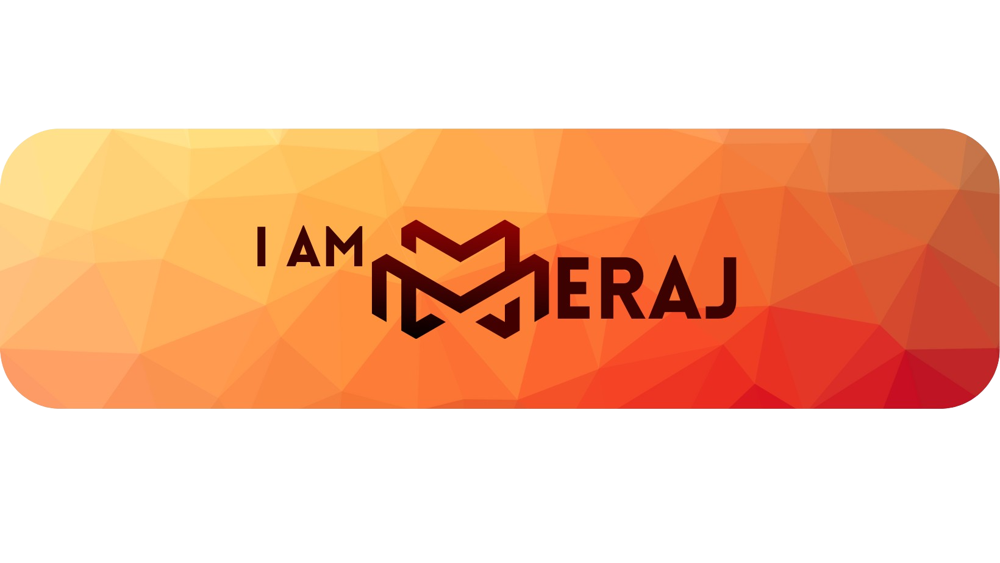

<picture>
  
</picture>

# Hi! Meraj here👋
I'm a CS student. I  enjoy exploring new technologies and building cool stuff for the web.

## My goals 🚀

- 🔭 Explore new web development trends and techs.
- 🌐 Build responsive and user-friendly web applications.
- 📚 Learn about backend development.

## What I know 💻 

  

 
## And my stats 📊

### I'm always looking to take part in open-source projects. Feel free to reach out if you have any collaboration ideas.
